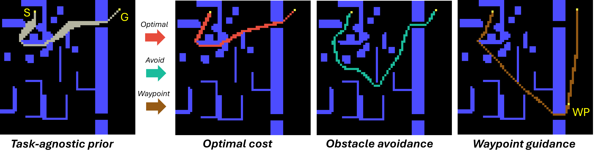

# FlexPath: Learned Semantic Path Priors for Image-Based Planning

<!-- BEFORE PUBLISH: update git clone link, cstar dependency link, citation -->

<p align="center">
  
</p>

<p align="center">
  <a href="#1-basic-setup">Setup</a> •
  <a href="#2-pretraining-and-fine-tuning">Training</a> •
  <a href="#3-evaluation">Evaluation</a> •
  <a href="#4-extending-the-system">Extending</a> •
  <a href="#citation">Citation</a>
</p>

---

## Overview

**FlexPath** is a two-stage framework that decouples path *feasibility* from path *preference* for image-based planning:

1. **Stage I — Imitation Pretraining:** Learn a task-agnostic spatial prior over feasible paths from visual map inputs.
2. **Stage II — PSO Fine-Tuning:** Adapt the prior toward task-specific criteria (shortest path, obstacle clearance, semantic avoidance, waypoint guidance) via differentiable *Path Shape Objectives* (PSOs) — without relearning path structure.

### Key Results

| Metric | FlexPath | TransPath |
|--------|----------|-----------|
| Expansion Ratio ↓ | **0.162** | 0.189 |
| Optimal Found ↑ | **0.880** | 0.750 |
| Hard Validity ↑ | **0.992** | 0.892 |

> A single pretrained model adapted to multiple objectives with strong zero-shot generalization across three unseen domains.

---

## This Repository Contains

- ✅ Training code for Stage I (pretraining) and Stage II (fine-tuning)
- ✅ Implementation of all PSOs
- ✅ Basic evaluation scripts

> [!NOTE]
> This branch is kept lightweight for easier extendability. See the `full` branch for baseline implementations and remaining evaluation scripts.

---

## 1) Basic setup

### Requirements

- Python 3.9 (see `pyproject.toml`)
- CUDA GPU recommended for training

### Clone repo:

```bash
git clone ...
```

### Install dependencies

**Python dependencies:**
Option 1 (uv):
```bash
uv sync
```

Option 2 (pip):
```bash
python -m venv .venv
source .venv/bin/activate
pip install .
```
**Compilation dependencies:**:
```bash
apt install gcc
```
(for torch.compile)

### Download Checkpoints:

```bash
curl -L -o experiments.zip https://owncloud.fraunhofer.de/index.php/s/pvO2lJaNFI1IOId/download
unzip experiments.zip
```

### Download Datasets

```bash
mkdir data
cd data

# TMP (512/64/64k)
curl -L -o TMP_640k_rgb.zip https://owncloud.fraunhofer.de/index.php/s/Md4nGgqQCGrUii8/download
unzip TMP_640k_rgb.zip

# CSM 1.9k (test only)
curl -L -o csm_1900.zip https://owncloud.fraunhofer.de/index.php/s/OdaJnfZwU1NGu4Z/download
unzip csm_1900.zip

# Starcraft 6k (test only)
curl -L -o starcraft_6k.zip https://owncloud.fraunhofer.de/index.php/s/51Dc4CPEwtztXYd/download
unzip starcraft_6k.zip
```

# Generate semantic dataset extensions

This is only required if you want to retrain or evaluate the waypoint/semantic obstacle avoidance objectives.

```bash
uv run python scripts/datagen/generate_semantic_obstacle_dataset.py
uv run python scripts/datagen/generate_waypoint_dataset.py
```

### Repository layout (high level)

- `scripts/pretraining/train_actor.py`: actor pretraining entrypoint
- `scripts/training/train_singleshot_pso.py`: single-shot fine-tuning entrypoint
- `configs/`: Hydra configs for training, models, and datasets
- `docs/`: detailed guides for pretraining, finetuning, and evaluation
- `src/`: core code (datasets, models, PSO objectives, training loops)
- `experiments/`: default output location for runs

## 2) Pretraining and fine-tuning

### Stage I (Pretraining)

Entrypoint: `scripts/pretraining/train_actor.py`

For a detailed guide, see [docs/pretraining.md](docs/pretraining.md).

Run with defaults:

```bash
python scripts/pretraining/train_actor.py
```

### Stage II (Finetuning)

Entrypoint: `scripts/training/train_singleshot_pso.py`

For a detailed guide, see [docs/finetuning.md](docs/finetuning.md).

Run with defaults:

```bash
python scripts/training/train_singleshot_pso.py
```

## 3) Evaluation

See [docs/evaluation.md](docs/evaluation.md) for how to run the evaluation
script and interpret its outputs.

Take a look at the notebooks folder for visualizations.

## 4) Extending the system

See [docs/pretraining.md](docs/pretraining.md) and [docs/finetuning.md](docs/finetuning.md) on how to add new backbones, PSOs or datasets.

## Notes

- All scripts are Hydra entrypoints; any config value can be overridden at the
	CLI with `key=value` syntax.
- Always use the 'latest' checkpoint over the 'best'. This is because the scaling of some components increase over the course of the training, which causes total loss / reward to become worse.


## Citation
```bibtex
@misc{FlexPath2026,
  title         = {FlexPath: Learned Semantic Path Priors for Image-Based Planning},
  author        = {Taehyoung Kim and Tim Sch{\"o}nbrod and David Eckel and Henri Mee{\ss}},
  year          = {2026},
  eprint        = {2026.00000},
  archivePrefix = {arXiv},
  primaryClass  = {cs.CV},
  url           = {https://arxiv.org/abs/2026.00000}
}
```
